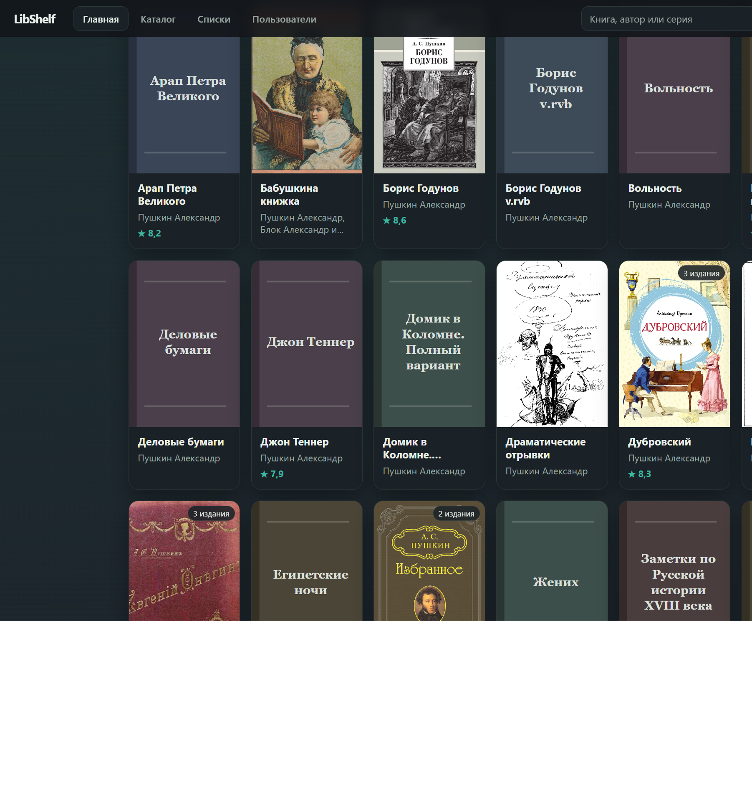
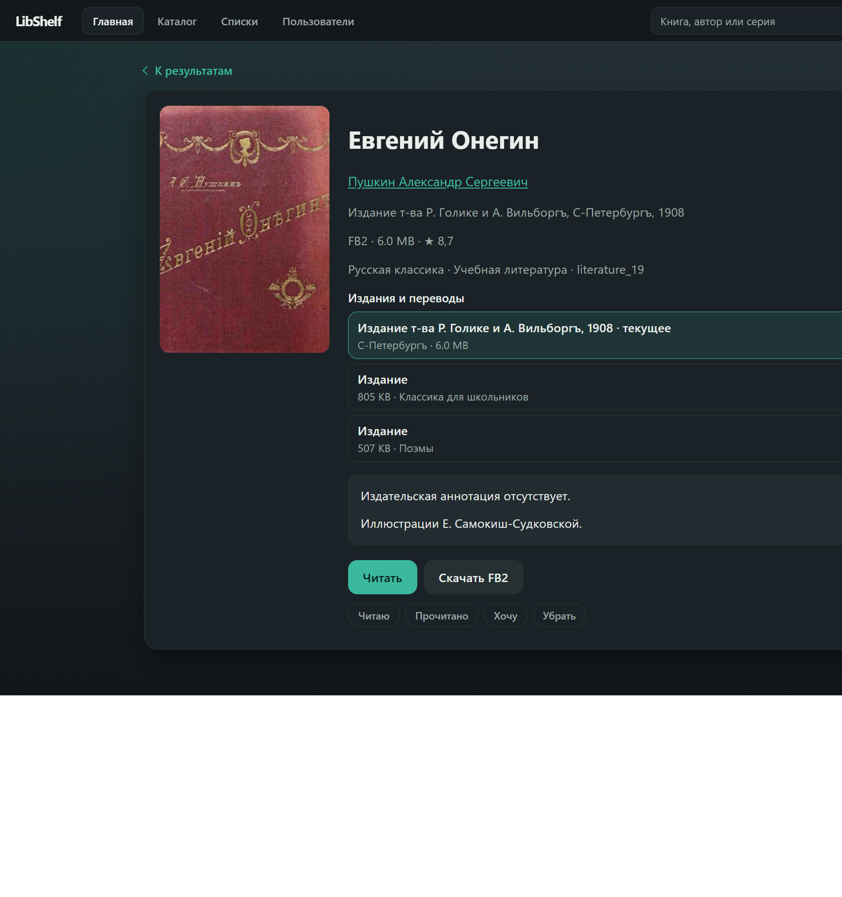
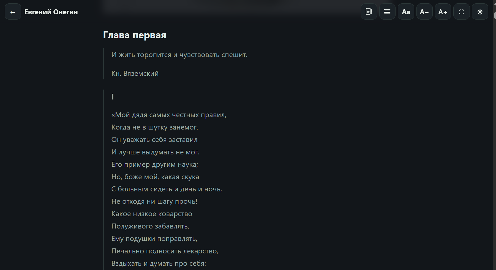

# LibShelf

Если у вас уже есть большая библиотека FB2 и каталог `.inpx` (MyHomeLib или совместимый дамп), LibShelf делает из неё каталог, которым можно пользоваться в браузере.

Книги никуда не переезжают. LibShelf читает существующий INPX и архивы FB2 и строит поверх них свой индекс, без новой раскладки файлов и без копирования коллекции.

В браузере: поиск, авторы и серии, разные издания одной книги, обложки, чтение, личные списки. Для внешней читалки есть OPDS.

Это приложение, которое запускается у себя: домашний сервер, NAS, VPS или обычный ПК.

## Как это работает

```text
Ваша существующая библиотека
        │
        ├── INPX
        └── архивы FB2
                │
                ▼
             LibShelf
                │
        ┌───────┴────────┐
        ▼                ▼
      Web UI            OPDS
```

LibShelf не заменяет хранилище книг, а индексирует его. `.inpx` читается в собственный индекс; FB2 по запросу берётся из исходных zip и 7z. Так открываются карточка, обложка, читалка и скачивание. В папке данных лежат индекс, кэш обложек и, если включён вход, аккаунты, полки и прогресс. Архивы программа не переписывает. После импорта `.inpx` серверу уже не нужен: остаются папки с архивами и папка данных.

## Что умеет

- поиск по автору, названию и серии
- авторы, серии и жанры
- разные издания и переводы на одной карточке
- обложки, аннотация, скачивание FB2
- чтение в браузере
- списки «Читаю», «Прочитано», «Хочу» и продолжение чтения
- OPDS для внешних читалок (`/opds`)
- новый каталог можно дописать, не копируя старую коллекцию



В поиске сверху показываются подходящие авторы; в расширенном можно указать год издания и дату добавления. «ё» и «е», «Имя Фамилия» и «Фамилия Имя» в поиске не мешают, выдача постраничная. Авторы и серии идут по буквам; в жанрах: «Популярные», «Новинки», «По алфавиту»; на странице автора видны его серии. Читалка: страницы (свайп вбок или вниз) или лента, шрифт, выравнивание, полный экран, прогресс. На карточках при входе виден процент прочитанного. Если в FB2 нет обложки, ставится заглушка с названием. Архивы могут лежать в нескольких папках. Языки каталога задаёт администратор (по умолчанию русский; можно несколько или все). Вход с ролями читатель и админ или без пароля.

Рейтинги FantLab на карточках и сортировка жанра «Популярные» по ним необязательны, см. [ниже](#рейтинги-fantlab). Для первого запуска это не нужно.

## Карточка книги

На одной странице: обложка, автор, серия, издание, жанры, чтение, скачивание FB2 и пользовательский статус. Разные издания и переводы собраны вместе, а не размазаны отдельными записями.



## Чтение в браузере

FB2 открывается в читалке прямо в браузере, без отдельного приложения. Сверху: листать страницами вбок или вниз либо лентой, выравнивание по ширине или по левому краю, гарнитура и размер шрифта, полный экран и светлая или тёмная тема. Колонка сама подстраивается под ширину окна. Если включён вход, место чтения запоминается.



## Как этим пользоваться

1. Берёте тот же `.inpx`, которым пользуетесь в MyHomeLib, и ту же папку архивов FB2.
2. Запускаете LibShelf и указываете эти пути. Импорт строит индекс; файлы книг остаются на месте.
3. Открываете библиотеку в браузере: поиск, авторы, серии, жанры, карточки.
4. Читаете в браузере или скачиваете FB2. Если включён вход, отмечаете книги и продолжаете с того места, где остановились.
5. Если нужна внешняя читалка, подключаете OPDS.

## Быстрый старт

Самый короткий путь: готовый бинарник с [Releases / latest](https://github.com/amachulan/libshelf/releases/tag/latest). Собирать из исходников для первой пробы не нужно.

### Windows

1. Скачайте [`libshelf-windows-amd64.exe`](https://github.com/amachulan/libshelf/releases/download/latest/libshelf-windows-amd64.exe).
2. Положите файл куда удобно и запустите двойным щелчком.
3. В браузере откроется мастер (`/setup.html`). Укажите:
   - файл `.inpx`
   - папку с архивами FB2
   - папку данных (по умолчанию `data` рядом с exe)
4. Дождитесь импорта. Если выбран вход с логином, на экране покажут пароль админа: сохраните его.
5. Пока пользуетесь библиотекой, **не закрывайте** окно консоли.

Повторный запуск: снова двойной щелчок. Настройки читаются из `libshelf.json` рядом с exe, браузер открывается сам.

Остановить: закрыть окно консоли или Ctrl+C.

Мастер настройки доступен только с этого компьютера. На удалённом сервере используйте CLI ниже.

### Linux: свой компьютер

Если на этой машине можно открыть браузер, запуск как на Windows: мастер настройки откроется сам.

```sh
curl -L -o libshelf \
  https://github.com/amachulan/libshelf/releases/download/latest/libshelf-linux-amd64
chmod +x libshelf
./libshelf start
```

Если каталог ещё не импортирован, откроется тот же мастер в браузере. Конфиг пишется в `libshelf.json` рядом с бинарником.

`./libshelf` без аргументов делает то же, что `./libshelf start`.

### Linux: сервер

С другой машины мастер не открыть: он работает только локально. Каталог импортируют и сервер поднимают из командной строки:

```sh
./libshelf import \
  --inpx /path/to/catalog.inpx \
  --library-dir /path/to/fb2/archives \
  --data-dir /path/to/libshelf-data

./libshelf serve \
  --library-dir /path/to/fb2/archives \
  --data-dir /path/to/libshelf-data \
  --auth users
```

Откройте `http://127.0.0.1:12380`. Проверка:

```sh
curl -s http://127.0.0.1:12380/health
# ok <git-sha>
```

`import` читает `.inpx` в SQLite. Архивы при этом не копируются; `--library-dir` нужен команде и позже `serve`, чтобы открывать книги из тех же папок.

Если пользователей ещё нет, при `--auth=users` создаётся админ: из `LIBSHELF_ADMIN_USER` и `LIBSHELF_ADMIN_PASS` или логин `admin` и случайный пароль в логе процесса.

Дальше: [авторизация](#авторизация), [OPDS](#opds), [nginx](#обратный-прокси-nginx), [два каталога](#два-каталога-inpx).

## Установка и настройка

### Готовые сборки

Каждый push в `master` собирает linux amd64 и windows amd64 и обновляет pre-release [`latest`](https://github.com/amachulan/libshelf/releases/tag/latest).

| Файл | Назначение |
|------|------------|
| [`libshelf-linux-amd64`](https://github.com/amachulan/libshelf/releases/download/latest/libshelf-linux-amd64) | сервер, NAS, VPS |
| [`libshelf-windows-amd64.exe`](https://github.com/amachulan/libshelf/releases/download/latest/libshelf-windows-amd64.exe) | ПК Windows |

### Сборка из исходников

Нужен Go 1.22+. CGO не требуется: один статический бинарник.

```sh
git clone https://github.com/amachulan/libshelf.git
cd libshelf
CGO_ENABLED=0 go build -o libshelf ./cmd/libshelf
```

Сборка под другую ОС:

```sh
CGO_ENABLED=0 GOOS=linux GOARCH=amd64 go build -o libshelf-linux-amd64 ./cmd/libshelf
CGO_ENABLED=0 GOOS=windows GOARCH=amd64 go build -o libshelf-windows-amd64.exe ./cmd/libshelf
```

### Что указать при запуске

1. Файл `.inpx` (формат MyHomeLib / совместимые сборки).
2. Каталог с архивами, на которые ссылается этот `.inpx` (`--library-dir`; можно несколько).
3. Каталог данных LibShelf: SQLite (поиск: FTS5), кэш обложек, при входе `users.db` (`--data-dir`).

Архивы: zip или 7z, как в типичном дампе FB2. LibShelf открывает файл внутри архива по записи из каталога.

Повторный полный импорт: `import --replace`. База пользователей `users.db` (аккаунты, полки, прогресс) при этом не трогается.

Дописать книги из другого `.inpx` без очистки базы: `import --append` (пропускаются LIBID, которые уже есть).

### Конфиг `libshelf.json`

При `start` файл лежит рядом с бинарником (или путь задаётся `--config`).

```json
{
  "addr": "127.0.0.1:12380",
  "library_dir": "/path/to/fb2/archives",
  "data_dir": "/path/to/libshelf-data",
  "inpx": "/path/to/catalog.inpx",
  "auth": "users",
  "languages": ["ru"],
  "open_browser": true
}
```

Несколько корней архивов: поле `library_dirs` (массив) плюс `library_dir`. На `serve` то же самое: повторяемый `--library-dir`.

Языки: в мастере, в `"languages"` (`["ru"]`, `["ru","en"]` или `["*"]`), флаг `--lang` (повторяемый) или `LIBSHELF_LANGUAGES=ru,en`. После смены языков при старте пересоберётся поисковый индекс.

`start` принимает `--addr HOST:PORT` и `--no-browser`. У `serve`: `--addr`, `--auth users|none`, `--lang`, `--open`.

## Авторизация

По умолчанию `--auth=users`: без логина UI и API закрыты, кроме `/health`, страницы входа и её статики.

| Роль | Доступ |
|------|--------|
| **reader** | поиск, карточки, скачивание, читалка, свои списки |
| **admin** | то же + управление пользователями в UI |

Добавить пользователя:

```sh
./libshelf user add \
  --data-dir /path/to/libshelf-data \
  --username alice \
  --password 'secret' \
  --role reader
```

Открытый режим без логина: `--auth=none`.

## Два каталога `.inpx`

Иногда в старом дампе есть книги, которых нет в свежем (или наоборот). Старый дамп можно не трогать: новый почистить от дублей и дописать в базу.

1. Положить свежий слепок в отдельную папку.
2. Убрать из нового `.inpx` то, что уже есть в базе:

```sh
./libshelf dedupe \
  --base-db /opt/libshelf/data/libshelf.db \
  --incoming /data/books-new/catalog.inpx \
  --out /data/books-new/catalog.unique.inpx \
  --library-dir /data/books-new \
  --prune-empty-archives
```

С `--dry-run` скрипт только покажет, какие архивы удалил бы `--prune-empty-archives`.

3. Дописать каталог:

```sh
./libshelf import --append \
  --inpx /data/books-new/catalog.unique.inpx \
  --library-dir /opt/libshelf/library \
  --data-dir /opt/libshelf/data
```

Архивы нового дампа можно оставить в своей папке и не копировать к старым.

4. Запускать `serve` с двумя корнями:

```sh
./libshelf serve \
  --library-dir /opt/libshelf/library \
  --library-dir /data/books-new \
  --data-dir /opt/libshelf/data \
  --auth users
```

В `deploy.sh`: `LIBSHELF_LIB_EXTRA=/data/books-new` (несколько путей через `:`).

Вместо `--base-db` можно указать эталонный старый `.inpx`: `--base /path/to/old.inpx`.  
При совпадении LIBID остаётся уже существующая запись.

## OPDS

Корень каталога:

```text
http://HOST:PORT/opds
```

Поиск: OpenSearch из корневого фида или `/opds/search?q=...`. Дальше авторы и серии по буквам, жанры, карточка книги и ссылка на FB2.

При `--auth=users` клиент должен уметь HTTP Basic (тот же логин и пароль, что в веб-интерфейсе). Basic Auth включён только для `/opds`, `/download/` и `/cover/`, чтобы браузер не подставлял сохранённые OPDS-учётные данные на весь сайт.

## Обратный прокси (nginx)

Типичная схема: LibShelf слушает localhost, снаружи HTTPS.

```nginx
server {
    listen 443 ssl http2;
    server_name books.example.com;

    # ssl_certificate …;
    # ssl_certificate_key …;

    location / {
        proxy_pass http://127.0.0.1:12380;
        proxy_http_version 1.1;
        proxy_set_header Host $host;
        proxy_set_header X-Forwarded-Host $host;
        proxy_set_header X-Forwarded-Proto $scheme;
        proxy_set_header X-Real-IP $remote_addr;
        proxy_set_header Upgrade $http_upgrade;
        proxy_set_header Connection "upgrade";
    }
}
```

Нужен `X-Forwarded-Proto`: иначе cookie сессии за HTTPS могут выставиться без флага `Secure`.

## Обновление с GitHub Releases

Скрипт `scripts/deploy.sh`:

- ждёт, пока в `latest` появится **текущий** commit `master` (не ставит предыдущую сборку);
- скачивает бинарник и сверяет `libshelf version` с SHA;
- подменяет файл и перезапускает процесс в `screen`.

Импорт и базу скрипт не трогает, только бинарник и перезапуск `serve`.

```sh
sudo mkdir -p /opt/libshelf
sudo curl -fsSL -o /opt/libshelf/deploy.sh \
  https://raw.githubusercontent.com/amachulan/libshelf/master/scripts/deploy.sh
sudo chmod +x /opt/libshelf/deploy.sh

sudo tee /opt/libshelf/deploy.env <<'EOF'
LIBSHELF_LIB="/mnt/share/books/fb2"
LIBSHELF_LIB_EXTRA="/mnt/share/books/fb2-new"
EOF

sudo /opt/libshelf/deploy.sh
```

Скрипт читает `/opt/libshelf/deploy.env` (или путь из `LIBSHELF_ENV`). Этот файл не затирается при повторном скачивании `deploy.sh`.

Переменные: `LIBSHELF_REPO`, `LIBSHELF_BIN`, `LIBSHELF_DATA`, `LIBSHELF_LIB`, `LIBSHELF_LIB_EXTRA` (доп. каталоги через `:`), `LIBSHELF_ADDR`, `LIBSHELF_AUTH` (`users` или `none`), `LIBSHELF_LANGUAGES`, `LIBSHELF_DEPLOY_WAIT`, `LIBSHELF_SCREEN`.

## Рейтинги FantLab

Необязательно. Без этого шага каталог, поиск и чтение работают как обычно.

Команда `fantlab-fetch` один раз обходит произведения в базе, ищет совпадение на FantLab (название + фамилия автора) и пишет рейтинг и число оценок в SQLite. Совпавшие книги показывают оценку на карточках. Сортировка жанра «Популярные» ставит выше хорошо оценённые произведения (с учётом числа голосов); без совпадения книга идёт ниже.

Между запросами к API по умолчанию пауза 1 с, большой каталог обходится долго. Можно ограничить жанр или число произведений за запуск и продолжить позже: уже обработанные ключи пропускаются.

```sh
./libshelf fantlab-fetch --data-dir /path/to/libshelf-data
./libshelf fantlab-fetch --data-dir /path/to/libshelf-data --genre detective --limit 500
./libshelf fantlab-fetch --data-dir /path/to/libshelf-data --retry-ambiguous
```

`--retry-failed` заново берёт и `none`, и неоднозначные совпадения; `--retry-ambiguous` только неоднозначные. `--config` подставляет `data-dir` и языки из `libshelf.json`.

## CLI

```text
libshelf                 (= start)
libshelf start           [--config FILE] [--addr HOST:PORT] [--no-browser]
libshelf import          --inpx FILE [--inpx FILE ...] --library-dir DIR --data-dir DIR [--replace|--append]
libshelf dedupe          --incoming FILE --out FILE (--base FILE | --base-db PATH)
                         [--library-dir DIR] [--prune-empty-archives] [--dry-run]
libshelf serve           --library-dir DIR [--library-dir DIR ...] --data-dir DIR
                         [--addr HOST:PORT] [--auth users|none] [--lang CODE] [--open]
libshelf user add        --data-dir DIR --username NAME --password PASS [--role admin|reader]
libshelf fantlab-fetch   --data-dir DIR [--config FILE] [--genre CODE] [--limit N]
                         [--delay 1s] [--retry-failed|--retry-ambiguous]
libshelf version
```

## HTTP API

| Метод | Путь | Описание |
|-------|------|----------|
| GET | `/api/search?q=&title=&author=&year=&added=` | поиск (`year`/`added` или `*_from`+`*_to`) |
| GET | `/api/book/{id}` | карточка (полка, прогресс, издания) |
| GET | `/api/book/{id}/read` | содержимое читалки (HTML) и оглавление |
| PUT | `/api/book/{id}/progress` | `{position:0..1}` |
| GET | `/api/author/{id}` | книги автора и его серии |
| GET | `/api/series/{id}` | книги серии |
| GET | `/api/shelf?status=reading\|read\|want` | полка |
| GET | `/api/shelf/continue` | продолжить чтение |
| PUT | `/api/shelf/{id}` | `{status}` или `{status:null}` |
| GET | `/api/catalog/authors` | буквы / авторы (`?q=`: префикс имени) |
| GET | `/api/catalog/series` | серии (`?q=`: префикс названия) |
| GET | `/api/catalog/genres` | жанры |
| GET | `/api/catalog/genres/{code}` | книги жанра (`?sort=popular\|new\|title`) |
| GET | `/opds` | корень OPDS |
| GET | `/cover/{id}` | обложка |
| GET | `/download/{id}` | скачать FB2 |
| GET | `/api/stats` | число видимых книг |
| GET | `/health` | `ok <sha>` |

При `--auth=users` большинство `/api/*` требуют сессию (cookie после `POST /api/login`).

## Лицензия

[MIT](LICENSE).
